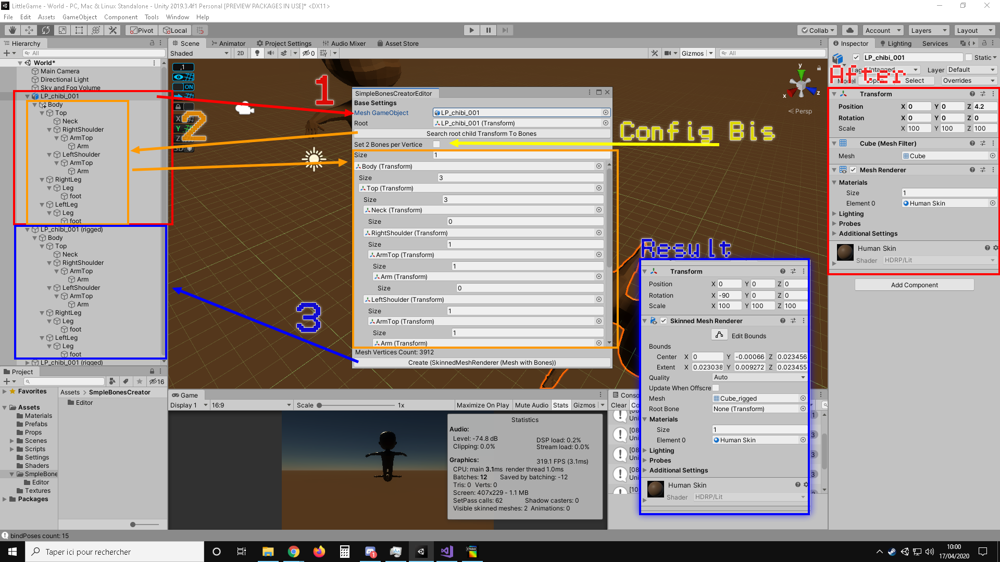

# Unity-Tools-SimpleCreatorBones
Simple Tool for unity for create Bones in your Mesh.

It works very basically, we define transforms and according to the distance with the vertice of the mesh, this asign.
A secondary config is available to assign the 2 closest bones.

